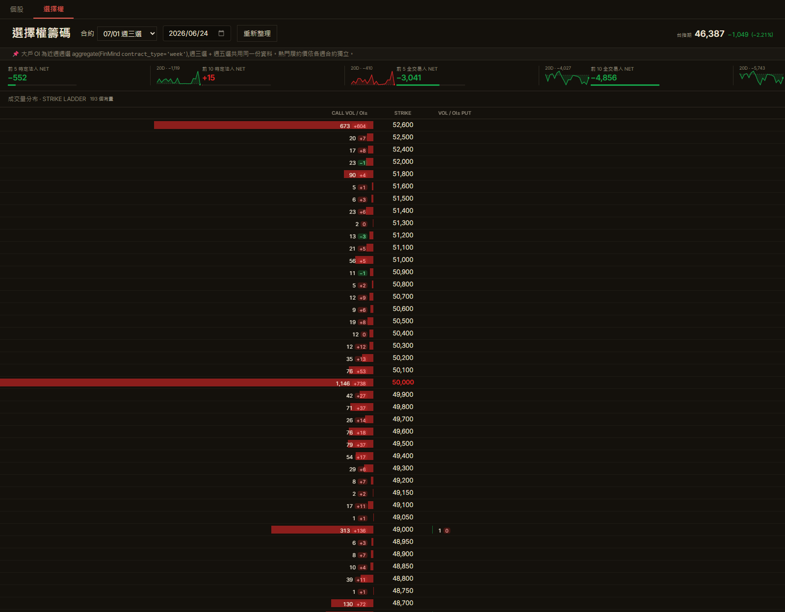
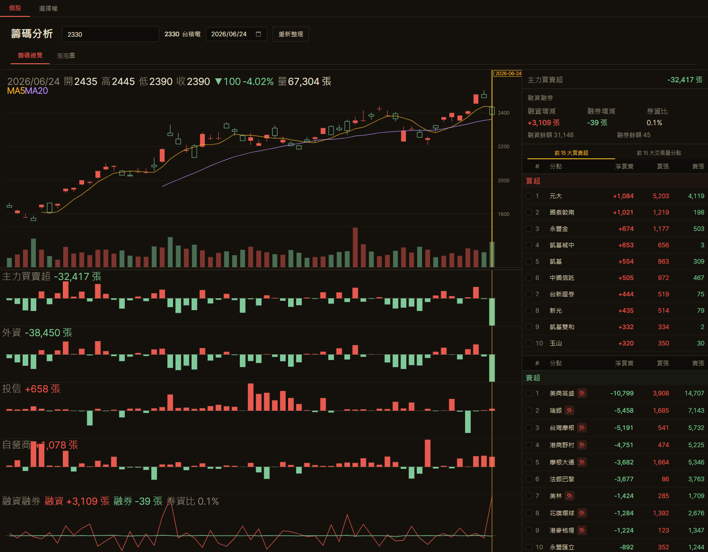
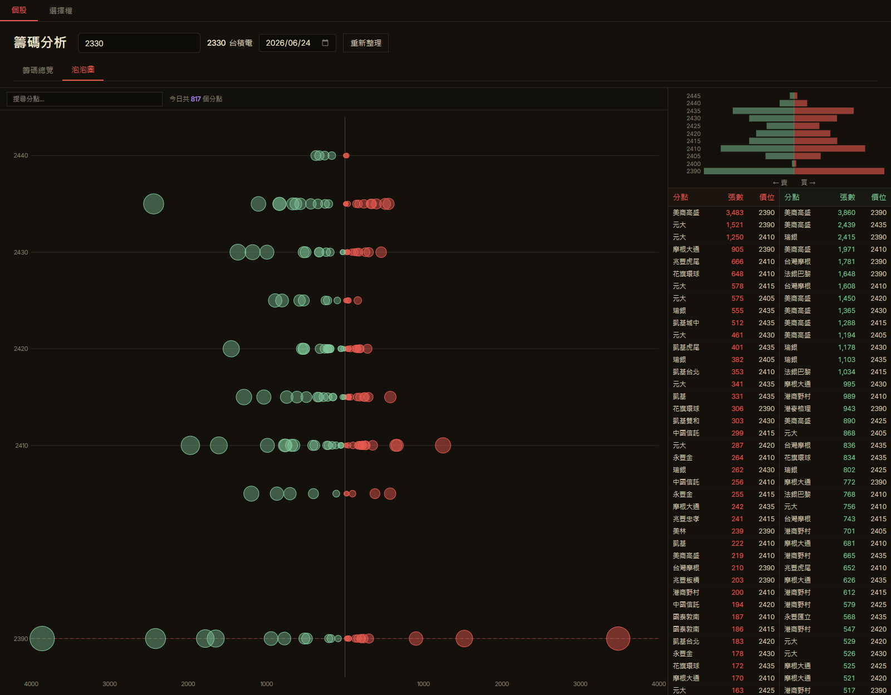

# §7 P0+P1+P2 Refactor — Real-environment verification

Verification run on **2026-06-24**, against dev server `localhost:5174`
(port 5173 was held by an unrelated stale node process; vite proxy makes
the port number transparent to the browser/back-end split).

## Automated gates

| Gate | Result |
|------|--------|
| `backend $ python -m pytest -q` | **111 passed** |
| `backend $ pyright` | **0 errors, 0 warnings, 0 informations** |
| `frontend $ npm test` | **190 passed / 24 files** |
| `frontend $ npm run build` | **✓ 754ms** (0 TS error) |
| `frontend $ npm run lint` | **0 errors, 14 warnings** (queued in `docs/refactor-next.md`) |

## Browser verification via Chrome DevTools MCP

### Options mode (default load, localStorage-remembered)

Endpoints hit and rendered correctly:

- `GET /api/options/oi_large_traders?contract=TXO202607W1&date=2026-06-24` → **200**
  - Renders 4 NET cards (前 5 特定法人 / 前 10 特定法人 / 前 5 全交易人 / 前 10 全交易人)
  - 20D sparkline per card
- `GET /api/options/strike_volume?contract=TXO202607W1&date=2026-06-24` → **200**
  - 193 strikes rendered in the Strike Ladder
  - 現價 anchor row at 46,387 inserted between 46,400 and 46,350
- `GET /api/options/spot?date=2026-06-24` → **200**
  - Header shows 台指期 46,387 (−1,049 / −2.21%)

### Equity mode — 2330 selected

Endpoints hit and rendered correctly:

- `GET /api/symbols/all` → **200** (cached infinite staleTime, fires once per session — verified by SymbolSearch dropdown showing `2330 台積電` instantly on type)
- `GET /api/chip/2330?date=2026-06-24` → **200**
  - 主力買賣超 −32,417 / 外資 −38,450 / 投信 +658 / 自營商 +1,078
  - 融資 +3,109 / 融券 −39 / 券資比 0.1%
- `GET /api/chip/2330/history` → **200**
  - K-line + MA5 / MA20 + 90D candles + 開高低收 2435/2445/2390/2390

### Equity mode — bubble tab (lazy loaded)

- `GET /api/chip/2330/bubble?date=2026-06-24` → **200**
  - 817 分點, 買賣張前 50
  - Lazy `<Suspense>` boundary loaded without flash

## Console / network summary

- Console errors: **1** (`/favicon.ico 404` — pre-existing, project has no favicon; unrelated to refactor)
- Console warnings: 0
- All seven endpoints in scope (`/api/options/oi_large_traders`, `/api/options/strike_volume`, `/api/options/spot`, `/api/symbols/all`, `/api/chip/{symbol}`, `/api/chip/{symbol}/history`, `/api/chip/{symbol}/bubble`) returned **200**

## Coverage caveat — `useBrokerHistory` not exercised in browser

The broker-pill checkbox is rendered `sr-only` for accessibility (visible
affordance is a styled ``), so DevTools MCP's `click(uid)` against
the checkbox uid times out — the click target needs to be the wrapping
label, not the input. Did not pursue a workaround in this session
because:

- `useBrokerHistory.test.ts` carries **9 passing tests** covering the
  hybrid (useMutation + setQueryData + disabled useQueries) pattern,
  including the two race cases (rapid-id flip + cross-symbol late
  resolve) that originally motivated the seqRef-based version.
- The endpoint was therefore not in the network log above.

## Conclusion

All seven refactored fetch hooks (P0), the `forwardRef` removal +
`noUncheckedIndexedAccess` (P1), the backend global exception handlers
+ pyright (P2-a/b), and the ESLint base + you-might-not-need-an-effect
plugin (P2-c) ship without runtime regression. The legacy `seqRef` +
`cacheRef` patterns are gone; TanStack Query owns server-state caching
end-to-end.
